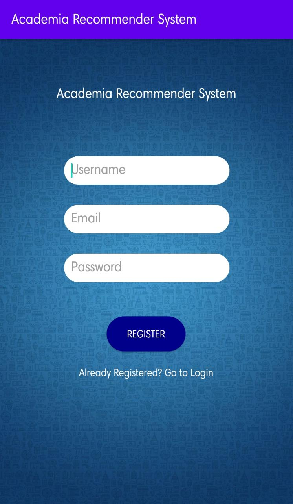
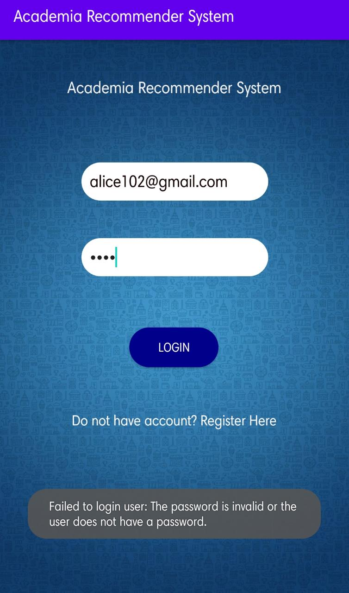
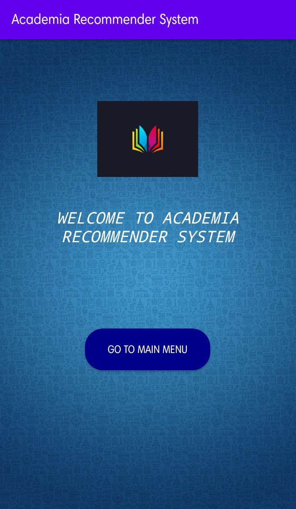
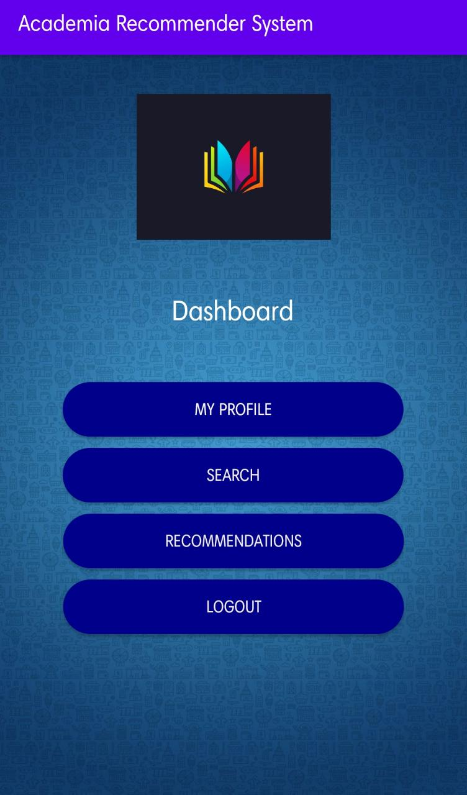
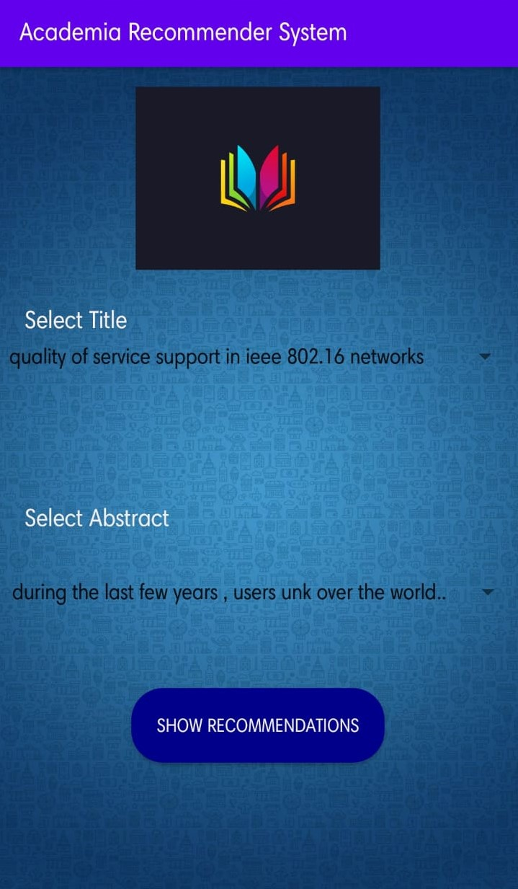
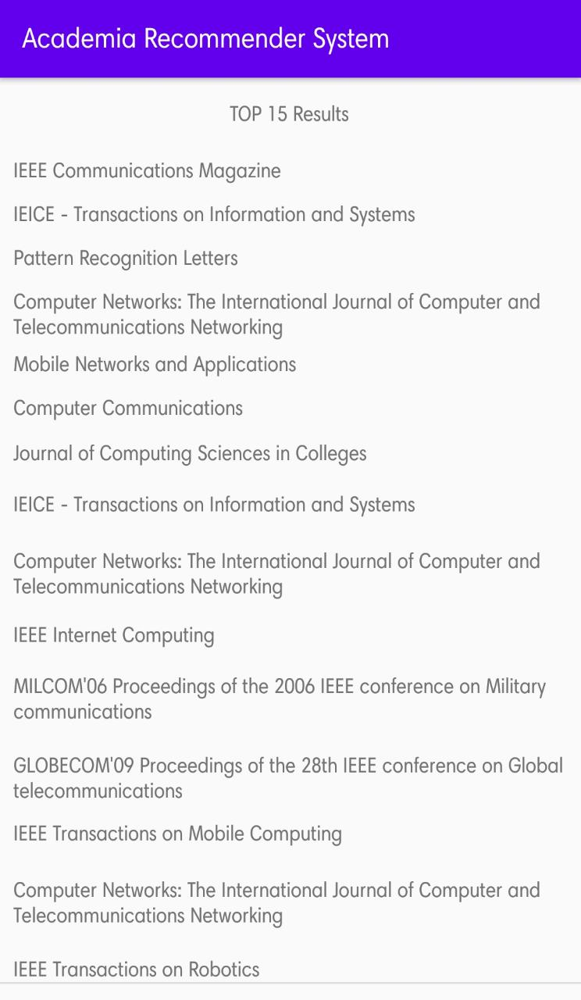

## Academia-Recommender-System
* This project depicts the integration of android application with Machine learning based recommender system algorithms connected to its backend.
* The main goal of this project is to build a system, which aids a user in finding research paper,journals or articles of interest to her from the first use of the system, at which point, the system does not know the user’s preferences. 
* The system should also collect application consumption data to base future studies on and to recommend stuffs. The solution preferably consist of a recommender system and possibly other filtering solutions.

### Motivation
There are several challenges awaiting future development of mobile application recommender systems. It is usually considered not a clever idea to integrate recommender system 
with android platform. Some challenges are common to all recommender systems research, and some specifically tied to either context-awareness or applications as
items.

## Screenshots
 
 
     
 
 
 

## Tech/framework used
* Kotlin-android
* Android studio
* Python
* Compiled SDK version : Version 29
* Rest API
* Google FireBase Authentication 

## Features
What makes your project stand out?
* Login and Registration UI for ensuring authentication
* Recommendation of top k news articles/research paper of journals according to user's input (title and keyword)
* Dashboard Activity
* Profile Activity
* Result Activity

